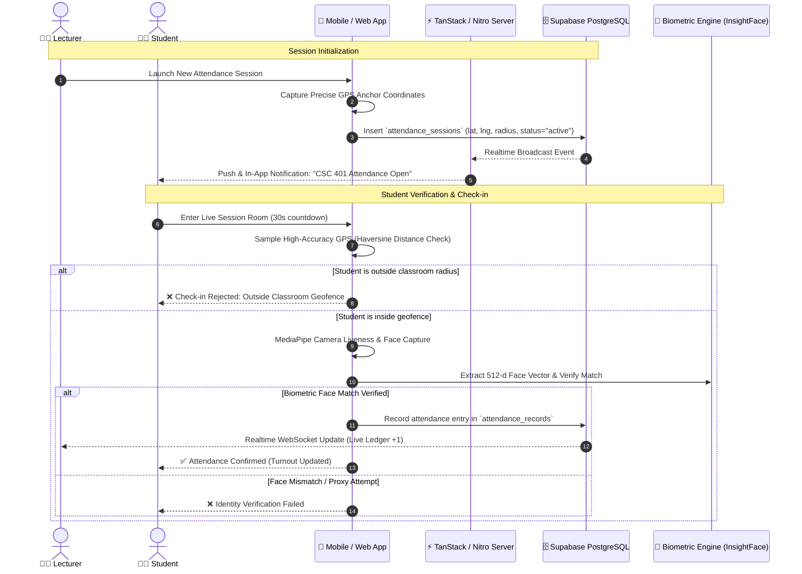

# 🎓 Smart Campus Presence (SCP)

> **Next-Generation Academic Attendance & Verification Platform**  
> Combining **Facial Biometrics (InsightFace + MediaPipe)**, **High-Accuracy GPS Geofencing**, and **Real-Time Institutional Ledgers** across Web & Android Mobile.

---

## 📌 1. Project Scope & Executive Summary

Traditional paper attendance sheets and manual roll calls in tertiary institutions suffer from pervasive **proxy attendance ("buddy punching")**, unverified physical presence, time wastage during lectures, and inaccurate semester compliance records.

**Smart Campus Presence (SCP)** is an enterprise-grade mobile and web platform designed to eliminate attendance fraud through multi-factor physical and biometric validation:

1. **Facial Biometric Identity Verification**: 512-dimensional facial embedding vectors matched against registered student biometric templates with client-side liveness detection.
2. **Classroom GPS Geofencing**: High-precision multi-sample geolocation verification ensuring students are physically within the lecturer's defined classroom perimeter (e.g., 50m – 150m radius).
3. **Institutional Real-Time Ledger**: Live synchronized lecture sessions, attendance audit trails, automated absence warning advisories to students and guardians, and curriculum oversight for department administrators.

---

## 🏗️ 2. System Architecture & Workflow



---

## 🚀 3. Core Functional Modules

### 👨‍🎓 Student Portal
* **4-Step Onboarding & Enrollment**:
  * Step 1: Personal & Guardian Information (Name, Matric/Reg No. e.g. `2021364065`, Email, Guardian Email & Phone).
  * Step 2: Academic Profile (Faculty, Department, Level `100L`–`500L`, Semester).
  * Step 3: Course Registration (Search and enroll in registered semester courses).
  * Step 4: Biometric Face Enrollment (Webcam/Mobile camera face template extraction).
* **Live Geofenced Check-In**:
  * Automatic GPS distance calculation relative to the lecturer's physical anchor.
  * 30-second live check-in timer with front-facing camera verification.
* **Attendance History & Compliance Analytics**:
  * Real-time course attendance rates with strict academic warnings when turnout drops below 75%.
* **Notification Center**:
  * Live session broadcasts, low turnout advisories, and consecutive absence alerts.

### 👨‍🏫 Lecturer Portal
* **Session Creator**:
  * Select course, title, and topic.
  * Real-time GPS coordinate anchoring with adjustable geofence boundaries (25m to 250m).
  * Automated email dispatch to all enrolled students upon session launch.
* **Live Attendance Ledger**:
  * Real-time student check-in updates powered by Supabase WebSockets.
  * Immediate student biometric snapshot verification and exact check-in timestamps.
  * Exportable attendance ledgers (CSV / Excel formatted).
* **Course & Student Directory**:
  * Overview of all enrolled students, face readiness status, and individual turnout history.

### 🛡️ Institutional Administrator Portal (`/admin/auth`)
* **Passcode-Protected Onboarding**:
  * Dedicated high-security admin authentication portal protected by a master institutional security key (`VITE_ADMIN_REGISTRATION_KEY`).
* **Lecturer Accreditation & Governance**:
  * Review, approve, reject, or suspend academic staff accounts.
* **Student Readiness Audit**:
  * Real-time institutional statistics for face enrollment coverage, course registration rates, and guardian contact coverage.
* **Multi-Step Curriculum & Department Management (CRUD)**:
  * **Step 1 (Target Academic Hierarchy)**: Select or create custom Faculties, Departments, Academic Levels (`100L`–`500L`), and Semesters.
  * **Step 2 (Dynamic Course Editor)**: Batch-create course units with Course Code (e.g. `EEE 401`), Title, and Credit Units.
  * **Step 3 (Live Inventory & Deletion)**: Search, filter, delete individual courses, or bulk-remove entire departmental course offerings with safety confirmation modals.

---

## 🔒 4. Security, Anti-Spoofing & Native Hardening

| Security Layer | Implementation Details |
| :--- | :--- |
| **Facial Biometrics & Liveness** | 512-dimensional feature embeddings extracted via ArcFace/InsightFace. Duplicate enrollment prevention via cosine distance similarity (`pgvector`). MediaPipe Face Mesh for client-side blink & liveness check. |
| **Geofencing & Anti-GPS Spoofing** | Multi-sample GPS averaging (minimum 5 samples, `<25m` accuracy threshold). Real-time Haversine distance verification computed against lecturer coordinates. |
| **Native Mobile Hardening** | Screen orientation strictly locked to `portrait` to prevent permission flip glitches. Global `-webkit-touch-callout: none;` and `-webkit-user-select: none;` applied to eliminate browser magnifying glasses and hold-to-copy popups. |
| **Cold-Start Session Persistence** | Multi-tier session hydration via `@capacitor/preferences` with fallback to `localStorage` and `supabase.auth.onAuthStateChange` listeners, ensuring zero session dropouts on mobile cold restarts. |
| **Database Row-Level Security (RLS)** | Strict PostgreSQL RLS policies ensuring students can only view their registered records, lecturers only manage their assigned courses, and admins oversee accredited data. |

---

## 💻 5. Technology Stack

* **Frontend Framework**: [TanStack Start](https://tanstack.com/start) (Full-stack React 19, SSR + Nitro Server Routes, TanStack Router)
* **Styling & Design System**: Tailwind CSS v4, Lucide Icons, Radix UI primitives, Sonner Toasts
* **Mobile Runtime**: [Capacitor 8](https://capacitorjs.com/) for native Android application packaging
  * `@capacitor/camera` — High-resolution front camera biometric capture
  * `@capacitor/geolocation` — Hardware GPS location positioning
  * `@capacitor/preferences` — Native encrypted keystore session persistence
  * `@capacitor/push-notifications` — Lock screen broadcast alerts
  * `@capacitor/splash-screen` & `@capacitor/status-bar` — Native Android polish
* **Database & Auth**: [Supabase](https://supabase.com) (PostgreSQL 15, Auth, RLS Policies, Realtime WebSocket Broadcasts)
* **Biometric Inference Microservice**: InsightFace ArcFace ResNet50 (Docker FastAPI container) + MediaPipe Vision

---

## 🗄️ 6. Database Schema Overview

```
├── public.profiles                 # User accounts (Students, Lecturers, Admins)
│   ├── id (uuid, FK -> auth.users)
│   ├── role ('student' | 'lecturer' | 'admin')
│   ├── name, email, phone, reg_number, staff_id
│   ├── department, faculty, level, academic_session
│   ├── face_enrolled (boolean), face_embedding (vector(512))
│   ├── guardian_name, guardian_email, guardian_phone
│   └── approval_status ('pending' | 'approved' | 'rejected')
│
├── public.courses                  # Institutional course catalog
│   ├── id (uuid)
│   ├── code (text, e.g. 'EEE 401')
│   ├── title (text, e.g. 'Digital Signal Processing')
│   ├── credit_unit (integer)
│   ├── department, level, semester
│   └── created_at, updated_at
│
├── public.attendance_sessions      # Active & past lecture sessions
│   ├── id (uuid)
│   ├── course_id (uuid, FK -> courses)
│   ├── lecturer_id (uuid, FK -> profiles)
│   ├── latitude, longitude (double precision GPS coordinates)
│   ├── geofence_radius (meters, default 100)
│   ├── status ('active' | 'closed')
│   └── started_at, closed_at
│
├── public.attendance_records       # Verified student attendance entries
│   ├── id (uuid)
│   ├── session_id (uuid, FK -> attendance_sessions)
│   ├── student_id (uuid, FK -> profiles)
│   ├── verification_status ('present' | 'flagged' | 'absent')
│   ├── distance_meters (numeric)
│   ├── face_similarity_score (numeric)
│   └── timestamp (timestamptz)
│
└── public.push_subscriptions       # Device push notification endpoints
    ├── id (uuid)
    ├── user_id (uuid, FK -> profiles)
    ├── endpoint, p256dh, auth (web push / device tokens)
    └── updated_at (timestamptz)
```

---

## ⚙️ 7. Environment Variables Reference

Create a `.env` file in the root directory based on `.env.example`:

| Variable | Description | Example / Default |
| :--- | :--- | :--- |
| `VITE_SUPABASE_URL` | Supabase Project URL | `https://xyz.supabase.co` |
| `VITE_SUPABASE_ANON_KEY` | Supabase Publishable / Anonymous Key | `eyJhbGci...` |
| `SUPABASE_SERVICE_ROLE_KEY` | Supabase Secret Service Role Key | `eyJhbGci...` |
| `VITE_ADMIN_REGISTRATION_KEY`| Master passcode for registering admins | `CAMPUS_ADMIN_2026` |
| `VITE_BIOMETRIC_API_URL` | InsightFace Biometric Microservice URL | `http://localhost:8000` |
| `VITE_DEFAULT_GEOFENCE_RADIUS`| Default classroom geofence perimeter (m) | `100` |
| `VITE_MAX_GPS_ACCURACY_THRESHOLD` | Max acceptable GPS accuracy (m) | `25` |
| `VITE_APP_URL` | Application base URL | `http://localhost:5173` |

---

## 🛠️ 8. Getting Started & Development

### Prerequisites
* **Node.js**: `v20.x` or `v22.x`
* **npm**: `v10+`
* **Android Studio & SDK**: (For native mobile Android APK building)
* **Docker**: (Optional, for local InsightFace biometric service)

### Web Development
```powershell
# 1. Install dependencies
npm install

# 2. Start development server
npm run dev

# 3. Build for production (SSR / Vercel Nitro)
npm run build
```

### Android Mobile Build & Sync (Capacitor)
```powershell
# Build web SPA bundle and sync assets to Android project
npm run mobile:build

# Run directly on connected Android device / emulator
npm run mobile:run

# Open the Android Studio project
npm run mobile:open
```

---

## 📦 9. Production Deployment

1. **Frontend & Server Routes**: Deploy to **Vercel** with the pre-configured `@tanstack/start` Nitro Vercel preset (`npm run build`).
2. **Database & Auth**: Hosted on **Supabase** with the included migrations in `supabase/migrations/`.
3. **Biometric Inference Engine**: Deploy the InsightFace Docker container on a GPU/CPU server (e.g. AWS EC2, DigitalOcean, or Railway) and set `VITE_BIOMETRIC_API_URL`.
4. **Android APK**: Build signed release APK / AAB through Android Studio (`Build > Generate Signed Bundle / APK`).

---

## 📄 License & Academic Attribution
Developed for academic institutions requiring verified student presence, tamper-proof attendance ledgers, and streamlined lecture management.
